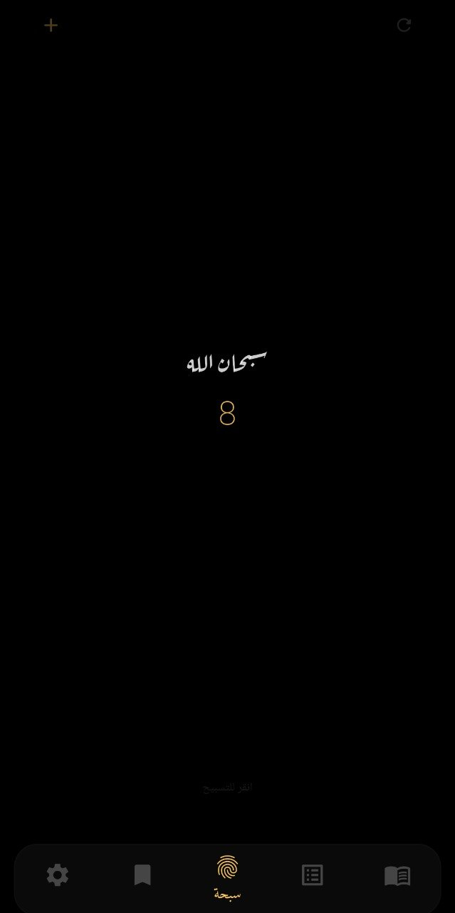
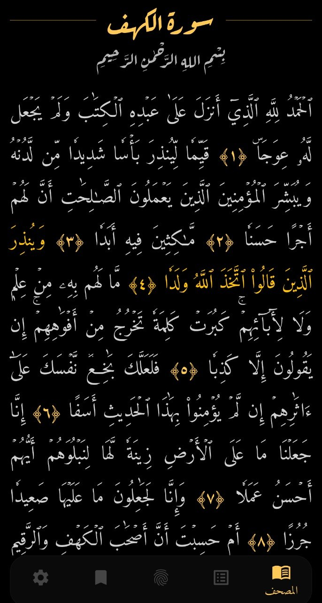
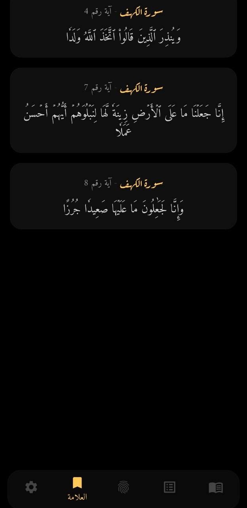

# رسالة - تطبيق القرآن الكريم

---

## عن التطبيق
**رسالة** هو تطبيق قرآن بسيط وهادئ، هدفه يساعدك تقرأ وتفهم وتعيش مع كلام الله بدون تعقيد.

- 📖 قراءة القرآن بسهولة
- 🌙 تصميم مريح للعين
- 🔍 تنقل سريع بين السور
- ❤️ تجربة روحانية بسيطة

---

## التحميل

  

---

##   لقطات من التطبيق

| السبحه | القراءة | الإعدادات |
|---------------|--------|----------|
|  |  |  |

---

##  الهدف
تطبيق خفيف يخليك تراجع للقرآن يوميًا بدون مشتتات.

> "خيركم من تعلم القرآن وعلمه"

